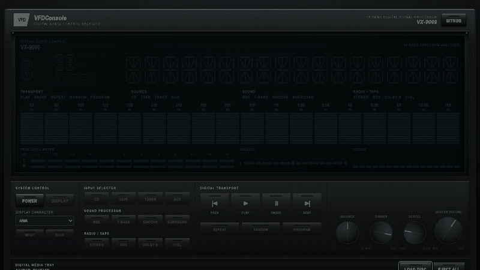

[](https://github.com/haskou/vfd-console/actions/workflows/ci.yml?query=branch%3Amaster)
[](https://codecov.io/gh/haskou/vfd-console)
[](https://www.npmjs.com/package/@haskou/vfd-console)
[](https://docs.renovatebot.com/)
[](LICENSE)

# VFDConsole

`@haskou/vfd-console` is a framework-agnostic TypeScript and CSS library for
building interfaces that behave like physical vacuum fluorescent displays.
Every character position, segment, meter block, and indicator stays mounted.
Updates only change discrete active states.

The project is inspired by
[**AmberConsole**](https://github.com/DutchDiederik/AmberConsole) and its
lightweight, CSS-first approach to reusable display interfaces: modular
stylesheets, stable theme tokens, framework-independent components, and a demo
that also serves as a reference implementation. VFDConsole applies that
philosophy to VFD hardware, with fixed 14-segment cells, permanently mounted
indicators, discrete state changes, and segmented meters.

[](https://haskou.github.io/vfd-console/demo/)

[Open the standalone live demo →](https://haskou.github.io/vfd-console/demo/)

## Install

```bash
yarn add @haskou/vfd-console
```

```ts
import {
  BalanceMeter,
  PeakLevelMeter,
  SegmentDisplay,
  SpectrumMeter,
  Spinner,
  TextScroller,
  VolumeMeter,
} from '@haskou/vfd-console';
import '@haskou/vfd-console/css';
```

The package is ESM-only and targets modern browsers with ES2022 support. Module
evaluation is safe in non-DOM environments, but component instances must be
created in a browser because they own real DOM elements.

The build can also be consumed directly. Import the browser module from an
inline module script so its exports are available to the application:

```html
<link rel="stylesheet" href="vfd-console.css" />

<div
  class="vfd-panel"
  data-vfd-preset="aiwa"
  data-vfd-blur="true"
  data-vfd-mesh="true"
>
  <div id="track-number"></div>
</div>

<script type="module">
  import { SegmentDisplay } from './vfd-console.js';

  const trackNumberElement = document.querySelector('#track-number');
  if (!(trackNumberElement instanceof HTMLElement)) {
    throw new Error('Track number host not found.');
  }

  const trackNumber = new SegmentDisplay(trackNumberElement, {
    cells: 2,
    color: 'primary',
    ariaLabel: 'Track 7',
  });

  trackNumber.setText('07');
</script>
```

Applications author the physical panel layout and component host elements.
VFDConsole creates and updates the permanent segment and meter geometry inside
those hosts.

`data-vfd-blur="true"` and `data-vfd-mesh="true"` opt into optical diffusion
and a fine glass-grid treatment independently. Both are disabled when omitted.

### Modular CSS

The complete stylesheet is the recommended default. Advanced integrations can
load only the stable CSS modules they need:

```css
@import '@haskou/vfd-console/css/tokens';
@import '@haskou/vfd-console/css/controls';
@import '@haskou/vfd-console/css/glass';
@import '@haskou/vfd-console/css/segments';
@import '@haskou/vfd-console/css/meters';
```

Import `tokens` first when composing modules. The JavaScript exports, CSS
subpaths, documented selectors, data attributes, and custom properties form
the public compatibility contract. Generated DOM structure is owned by the
components and should not be authored manually.

## Development

```bash
corepack enable
yarn install
yarn dev
yarn docs:dev
yarn check
```

The demo is served by Vite and is available from the URL printed by
`yarn dev`.

### Demo audio player

The demo is a functional local audio player. Add or drop multiple browser-
supported audio files, select and remove queue entries, and use the transport,
repeat, random, volume, power, and display-test controls. Playback time and the
18-band spectrum and stereo peak meter are derived from the active audio
element through the Web Audio API.

Files stay in the browser tab as temporary object URLs. They are not uploaded
or persisted, and their URLs are released when tracks are removed, the queue is
cleared, or the page closes. Codec support depends on the browser.

## Documentation

- [Documentation home](https://haskou.github.io/vfd-console/)
- [Getting started](https://haskou.github.io/vfd-console/getting-started)
- [Components](https://haskou.github.io/vfd-console/components)
- [CSS API](https://haskou.github.io/vfd-console/css-api)
- [Theming](https://haskou.github.io/vfd-console/theming)
- [Accessibility](https://haskou.github.io/vfd-console/accessibility)
- [VFD style guide](https://haskou.github.io/vfd-console/style-guide)
- [Complete component reference](https://haskou.github.io/vfd-console/reference/)

## Release Branches

CI publishes npm versions from pull requests merged into the default branch
according to the source branch prefix, or from Renovate/runtime dependency PRs
whose title starts with `fix:` or `fix(...):`.

| Branch prefix | npm version bump |
| ------------- | ---------------- |
| `fix/*`       | Patch            |
| `feat/*`      | Minor            |
| `break/*`     | Major            |

Other branch names run validation only and do not publish.
